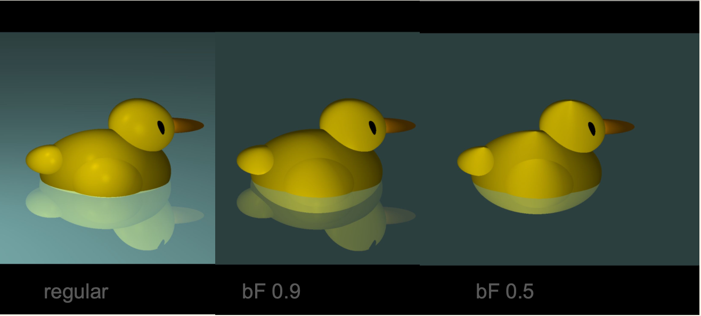

# Raytrace-Rubber-Duck
Simplistic implementation of Ellipses in a C++ raytracing environment to create a rubber duck.

author: Laura Livers
date: April 25th 2024

This project was done in the context of the module _Raytracing von Grund auf_ at the University of Applied Sciences Lucern (CH) 
and resulted in Grade A.

_This code can be used, but remember: credit, where credit's due!_

## Formula implemented in ellipse.cpp
**Ray**      : $w = p + \lambda u$  

**Ellipse**  : $\frac{x^2}{a^2}+\frac{y^2}{b^2}+\frac{z^2}{c^2}=1$ 

**rewrite**  : $\frac{(w_x-q_x)^2}{a^2}+\frac{(w_y-q_y)^2}{b^2}+\frac{(w_z-q_z)^2}{c^2}=1$ 

**Intersect**: $\frac{((p_x + \lambda u_x) -q_x)^2}{a^2}+\frac{((p_y + \lambda u_y)-q_y)^2}{b^2}+\frac{((p_z + \lambda u_z)-q_z)^2}{c^2}=1$ 

**rewrite**  : $\frac{(\lambda u_x + v_x)^2}{a^2}+\frac{(\lambda u_y + v_y)^2}{b^2}+\frac{(\lambda u_z + v_z)^2}{c^2}=1$ 

**expand**   : $\frac{\lambda^2u_x^2}{a^2}+\frac{\lambda 2u_x v_x}{a^2}+\frac{v_x^2}{a^2}+\frac{\lambda^2u_y^2}{b^2}+\frac{\lambda 2u_y v_y}{b^2}+\frac{v_y^2}{b^2}+\frac{\lambda^2u_z^2}{c^2}+\frac{\lambda 2u_z v_z}{c^2}+\frac{v_z^2}{c^2} - 1 = 0$ 
 

In order to "plot" the Elipse we're using the **discriminant**:  

$D = B^2 - 4 * A * C$ 

and the **midnight formula**: 

$\frac{-B - sqrt{D}}{2 * A}$  

$\frac{B - sqrt{D}}{2 * A}$  
 
**redefine**: 
$A = \frac{u_x^2}{a^2}+\frac{u_y^2}{b^2}+\frac{u_z^2}{c^2}$ 
 
$B = 2 * \Bigr[\frac{u_xv_x}{a^2}+\frac{u_xv_y}{b^2}+\frac{u_xv_z}{c^2}\Bigr]$ 
 
$C = \frac{v_x^2}{a^2}+\frac{v_y^2}{b^2}+\frac{v_z^2}{c^2}$ 

**to create the entire Rubber Duck, take note of the file scn.cpp where all coordinates 
of the different body parts are made to depend on each other so the duck can be placed
randomly within the scene**

These files are part of a bigger skeleton, that wasn't authored by me and therefor will not be published as such. If a glimpse of it helps to solve a problem, feel free to reach out and I'll send you a copy.
